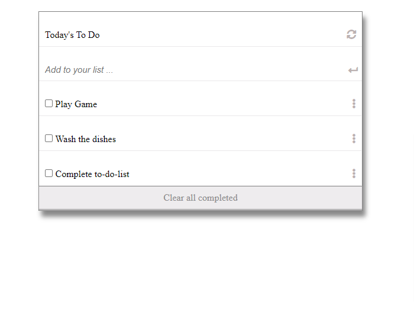

# To-do-list

> This is my first project using webpack in the Microverse. The objective was to build a to-do-list by sticking with some design criteria, some ES6 modules and syntax. For that I created to-do-list repo and cloned into my local machine. For best practices I have implemented Linter,Github Flow and professional documentation as much as I can. 

## Built With

- HTML, CSS, js
- Linters, Markdown
- GitHub Flow 

## Live Demo
 [Live Preview of my website](https://basnetlaxmi.github.io/to-do-list/)

## Getting Started

To get a local copy up and running follow these simple example steps.

1) Enter `git@github.com:basnetlaxmi/to-do-list.git` into terminal

2) Open in browser to view site

### Prerequisites

- Code editor

- Git and Github

## Author

👤 **Laxmi Basnet**

- GitHub: [@basnetlaxmi](https://github.com/basnetlaxmi)
- LinkedIn: [LinkedIn](https://np.linkedin.com/in/laxmi-basnet-b22403131)

## 🤝 Contributing

Contributions, issues, and feature requests are welcome!

Feel free to check the [issues page](../../issues/).

## Show your support

Give a ⭐️ if you like this project!

## Acknowledgments

- Microverse learning partners
- Microverse

## 📝 License

This project is [MIT](./MIT.md) licensed.
